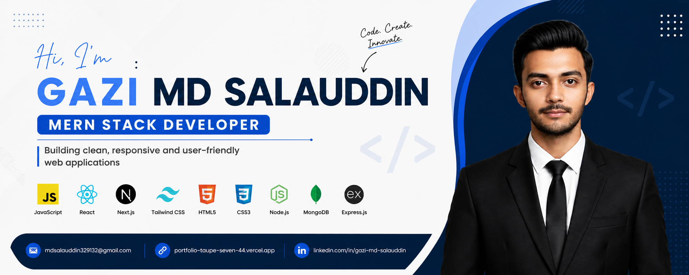

<h1 align="center">Hi 👋, I'm Gazi Md Salauddin</h1>
<h3 align="center">Junior Full Stack Developer | Next.js | React | JavaScript | TypeScript | Node.js | Express.js | MongoDB | Mongoose | BetterAuth | HTML | CSS | Tailwind | Building clean and scalable web apps</h3>

  
   

<h3>Talking about Personal Stuff:</h3>

- 🛠️ I’m currently working with **NextJs, TypeScript, NodeJs, ExpressJs, MongoDB, BetterAuth, Javascript, React, HTML, CSS, Tailwind**

- 🚀 I'm currently exploring **PostgreSql**

- 📫 Reach me out: **mdsalauddin329132@gmail.com**

<h3>My Favourites:</h3>

- 💻 I love exploring new technologies and building cool stuff.

## <b> Technology Stack:</b>

### Languages:

### CSS Frameworks & Libraries:

### Javascript Frameworks & Libraries:

### Authentication:

### Database:

### Deployment Tools:

### Design Tools:

### Tools & Technologies:
 

### 📊 Repository Stats & Streak

| Repository Stats | GitHub Streak |
| --- | --- |
|  |  |

<!--- visit count --->

  

